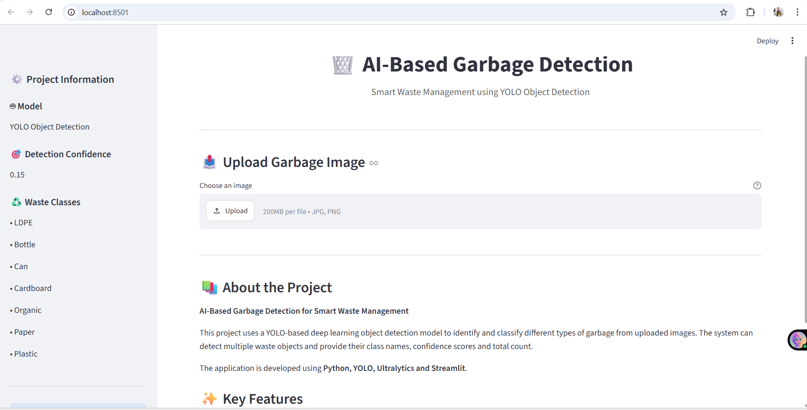
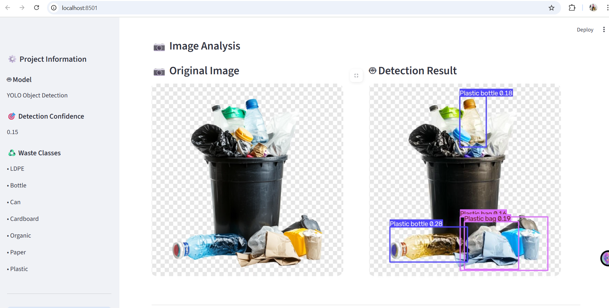
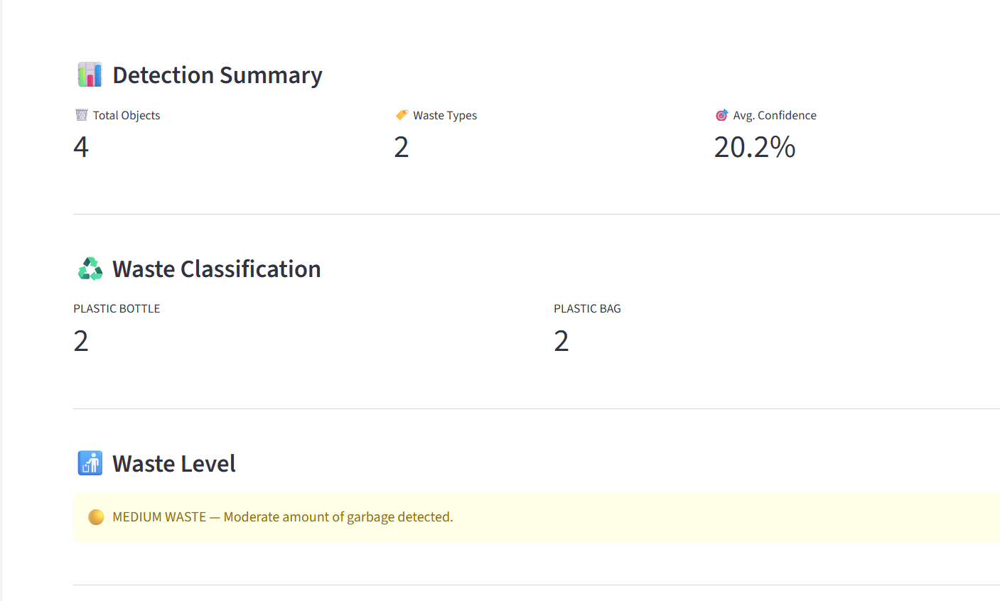

# 🗑️ AI-Based Garbage Detection for Smart Waste Management

## 📌 Project Overview

**AI-Based Garbage Detection for Smart Waste Management** is a Deep Learning and Computer Vision project designed to automatically detect and classify different types of garbage from images.

The system uses a **YOLO Object Detection model** to identify waste objects and provides:

- Garbage detection
- Waste classification
- Bounding box visualization
- Confidence scores
- Total object count
- Waste-type count
- Average detection confidence
- Waste level analysis

The project also includes an interactive **Streamlit web application** that allows users to upload an image and view the detection results.

---

## 🎯 Objectives

The main objectives of this project are:

- To automatically detect garbage using Artificial Intelligence.
- To classify garbage into different waste categories.
- To display detected objects with bounding boxes.
- To calculate detection confidence.
- To count different types of waste.
- To provide a simple and interactive web interface.
- To demonstrate the use of Deep Learning in smart waste management.

---

## 🧠 Technologies Used

| Technology | Purpose |
|---|---|
| Python | Programming Language |
| YOLO | Object Detection |
| Ultralytics | YOLO Framework |
| Streamlit | Web Application |
| Pillow | Image Processing |
| Roboflow | Dataset |
| Git & GitHub | Version Control |

---

## ♻️ Waste Categories

The trained model can detect the following 7 waste categories:

1. LDPE
2. Bottle
3. Can
4. Cardboard
5. Organic
6. Paper
7. Plastic

---

## 📁 Project Structure

AI-Based-Garbage-Detection/
│
├── app.py
├── README.md
├── requirements.txt
├── .gitignore
│
├── check_dataset.py
├── check_9class_distribution.py
├── create_9class_dataset.py
│
└── screenshots/
    ├── main_interface.png
    ├── detection_result.png
    ├── detection_report.png
    └── detection_report2.png

The trained model, dataset, virtual environment, training outputs and test images are excluded from GitHub using .gitignore.

---

## ⚙️ System Architecture

Input Image
     ↓
Image Preprocessing
     ↓
YOLO Object Detection
     ↓
Waste Classification
     ↓
Confidence Calculation
     ↓
Object Counting
     ↓
Waste Level Analysis
     ↓
Streamlit Dashboard

---

## 🖥️ Application Screenshots

### Main Interface

### Garbage Detection

### Detection Report

---

## 🚀 Installation

### 1. Clone the Repository

git clone https://github.com/Santanu12-paria/AI-Based-Garbage-Detection.git

### 2. Open the Project

cd AI-Based-Garbage-Detection

### 3. Create a Virtual Environment

python -m venv venv

### 4. Activate the Virtual Environment

For Windows PowerShell:

venv\Scripts\Activate.ps1

### 5. Install Required Libraries

pip install -r requirements.txt

---

## ▶️ Running the Application

After activating the virtual environment, run:

streamlit run app.py

The Streamlit application will open in your web browser.

---

## 🎯 Detection Configuration

The application currently uses a YOLO confidence threshold of:

0.15

This threshold allows the application to detect objects with relatively low confidence while providing better detection coverage for different garbage images.

---

## 📊 Application Features

### 📷 Image Upload

Users can upload garbage images in:

- JPG
- JPEG
- PNG

formats.

### 🤖 AI Garbage Detection

The YOLO model detects garbage objects and displays bounding boxes around the detected objects.

### 🏷️ Waste Classification

The system identifies the type of detected garbage.

Supported categories:

- LDPE
- Bottle
- Can
- Cardboard
- Organic
- Paper
- Plastic

### 📊 Detection Summary

The application displays:

- Total objects detected
- Number of waste types
- Average detection confidence

### ♻️ Waste Classification Count

The application provides the number of objects detected for each waste category.

### 🔎 Detection Details

Each detected object is displayed with its confidence score.

Example:

1. BOTTLE — 91.4% confidence
2. CARDBOARD — 84.7% confidence
3. PLASTIC — 76.2% confidence

The actual values depend on the uploaded image.

### 📋 Detection Report

The application generates a report containing the detected waste types and their confidence scores.

Example:

| Waste Type | Confidence |
|---|---:|
| Bottle | 91.4% |
| Cardboard | 84.7% |
| Plastic | 76.2% |

---

## 🚮 Waste Level Analysis

The application calculates the waste level based on the number of detected objects.

| Objects Detected | Waste Level |
|---|---|
| 0–3 | 🟢 LOW |
| 4–7 | 🟡 MEDIUM |
| 8+ | 🔴 HIGH |

### 🟢 LOW

A small number of garbage objects are detected.

### 🟡 MEDIUM

A moderate number of garbage objects are detected.

### 🔴 HIGH

A large number of garbage objects are detected.

---

## 📈 Results

The system can detect multiple types of garbage from uploaded images.

The model supports the following waste categories:

- LDPE
- Bottle
- Can
- Cardboard
- Organic
- Paper
- Plastic

Detection performance can vary depending on:

- Image quality
- Lighting conditions
- Object size
- Object orientation
- Occlusion
- Similarity between waste categories

---

## ⚠️ Limitations

The current system has some limitations:

- Some waste categories have similar visual characteristics.
- Small objects may be difficult to detect.
- Partially hidden objects may reduce detection performance.
- Detection depends on image quality and lighting.
- Some waste categories may be challenging in certain images.
- CPU-based inference can be slower than GPU-based inference.

---

## 🔮 Future Scope

Future improvements can include:

- 📱 Mobile application
- 🌐 Deployment as an online web application
- 🏙️ Integration with smart-city waste management systems
- 📊 Real-time camera-based garbage detection
- 🚮 Automated waste segregation systems
- 📈 Advanced waste analytics and reporting

---

## 👨‍💻 Project Information

**Project Title:** AI-Based Garbage Detection for Smart Waste Management

**Domain:** Deep Learning / Computer Vision

**Programming Language:** Python

**Model:** YOLO Object Detection

**Framework:** Ultralytics YOLO

**Web Interface:** Streamlit

**Dataset:** Trash-Waste Detection Dataset

---

## 📚 Dataset

The dataset used for this project was obtained from **Roboflow**.

Dataset categories include:

- LDPE
- Bottle
- Can
- Cardboard
- Organic
- Paper
- Plastic

The dataset was prepared in YOLO format for object detection.

---

## 🔗 GitHub Repository

https://github.com/Santanu12-paria/AI-Based-Garbage-Detection

---

## 📜 License

This project is developed for educational and academic purposes.

The dataset used in this project follows its respective dataset license.

---

## ⭐ Conclusion

The **AI-Based Garbage Detection for Smart Waste Management** project demonstrates how Deep Learning and Computer Vision can be used to automatically identify and classify different types of waste.

The Streamlit application provides a simple interface for uploading images and viewing AI-based garbage detection results, making the system useful as a prototype for intelligent waste management applications.